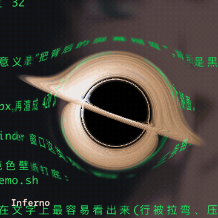

<div align="center">

# Black Hole

**一个待在你桌面上、把背后屏幕掰弯的史瓦西黑洞。**

[](https://github.com/ZGhey/blackhole-mac/releases/latest)
[](https://github.com/ZGhey/blackhole-mac/releases/latest)
[](https://github.com/ZGhey/blackhole-mac/releases/latest)
[](LICENSE)

[English](README.md) · **简体中文**



</div>

Metal、一个全屏三角形、一个片元着色器。洞附近的每一个像素都在史瓦西度规下积分
自己的零测地线,黑洞阴影、引力透镜、光子环、吸积盘的多重像和时间膨胀,全都是从
那次积分里长出来的,不是画上去的。

它浮在你的窗口上方,**把背后活的屏幕掰弯**。你的编辑器、浏览器、访达图标,是真的
绕着视界扭曲。

## 安装

下载最新的 **[`Black Hole.dmg`](../../releases/latest)**,拖进「应用程序」。

这份有签名但**没有公证**,所以第一次打开要右键 ▸ **打开**,不能双击。之后 macOS
就记住了。

需要 **macOS 13 或更高版本 + Apple 芯片**。没有 Dock 图标,也没有主窗口:应用住在
菜单栏里(⚫)。菜单跟随系统语言 —— 英文、简体中文、繁体中文、日语。

想自己构建,见[自己构建](#自己构建)。

## 怎么用

菜单里只有两样东西,因为需要的就这两样:

- **尺寸** —— 小、中、大。在圆盘上任意位置拖动即可移动。
- **样式** —— Inferno、Gargantua、M87\* donut、Face-on ember、Quasar、Blazar、
  Pure lens、Zen。它们对吸积盘该有多宽的意见差得很远(Gargantua 是 7 r_s,
  Blazar 是 16),所以洞会自动缩小,直到发亮的部分刚好装进画框。每个样式都填满
  同一个部件,谁也不会被裁掉。

其余的事情,它不用你吩咐就在做:

- **往上面丢东西** —— 文件、一段选中的文字、一个链接、一张图 —— 然后看着它被吃掉
  ([怎么吃的,以及为什么这么吃](#被吃掉))。**它什么都不动**:动画就是全部,不会
  移动、复制或删除任何东西。
- **把指针放进去**,指针的影像会被拖向中心,拉长、变红,直到熄灭。真正的指针从头
  到尾没被碰过;移出来,影像就追上来。
- **它透镜的是活的屏幕**,这就是屏幕录制权限的用处。没有那个权限,它就在透明背景
  上画洞和星场,照常运行。

菜单里剩下的,是那些算不上「设置」的东西:

- **登录时启动** —— 通过 `SMAppService` 注册。需要签过名的 bundle,所以在
  `swift run BlackHoleApp` 下不起作用。
- **检查更新…** —— 见[更新](#更新)。
- **高级…** —— 每个可调项一个滑块,当样式不够用时。调出来的东西可以留下:
  样式 ▸ **存储当前样式为…**。自定义样式是整份存下来的,而不是稀疏补丁 ——
  因为你保存的是你当时看到的样子,继承上一次加载留下的零散值并不能复现它。
  这个面板只有英文:那些标签是参数名,必须跟着色器和文档对得上。
- **⌥⌘B** 隐藏和显示。用的是 Carbon 的 `RegisterEventHotKey`,刻意不用
  `NSEvent` 监听 —— 后者监听按键需要辅助功能权限,而一个你想藏起来的小部件,
  不该顺便要求「看你敲的每一个字」的权利。隐藏不是装样子:它先淡出,然后拆掉
  捕捉流、停止绘制、停掉指针轮询并释放光标 —— 可见时 10.3% CPU,隐藏后 0.0%,
  而且 macOS 不再提示有东西在录你的屏幕。回来大约需要 130 ms,盖在淡入里面。
  显示器休眠、会话锁定、窗口被完全遮挡,都会以同样的方式让它停下。这个状态跨
  重启记得住。
- 位置是**按显示器**分别记的。停在笔记本屏幕角落的部件,没道理在你接上 5K 屏之后
  跑到它正中间去,反过来则会掉到屏幕外面。

## 权限

**屏幕录制**是活屏幕透镜需要的,macOS 问的时候授权即可。除此之外什么都不要 ——
不要辅助功能,也不要输入监控。

值得知道构建为什么要给自己签名。macOS 把 TCC 授权绑在应用的*指定要求*上,而
ad-hoc 签名产生的要求是从二进制自身的哈希算出来的:

```
designated => cdhash H"ebe3f233a58da2216530360c39fedcd7e4dcb103"
```

每次重新构建那个哈希都会变,于是每次重新构建都会悄无声息地撤销权限。
`make-signing-cert.sh` 只需创建一次自签名的代码签名身份,`make-app.sh` 之后就能
找到它,要求随之锚定到证书上:

```
designated => identifier "dev.zghey.blackhole" and certificate leaf = H"bf84f9…"
```

这样授权就能熬过重新构建。想全部撤销:
`security delete-certificate -c "Black Hole Dev"`。

万一权限还是卡住了,菜单里的**重新请求屏幕录制权限**会执行
`tccutil reset ScreenCapture`,让 macOS 重新弹窗。被拒绝或失败的捕捉每 5 秒重试
一次,并且只报告一次而不是刷屏 —— 立刻重试的循环会把 TCC 捶爆,也会把日志淹掉。

## 更新

菜单里的**检查更新…**,外加它自己每天查一次。下载、校验、替换、重启这一段由
Sparkle 负责;appcast 和 dmg 都是[最新 release](../../releases/latest) 的附件,
这正是 `releases/latest/download/appcast.xml` —— 应用出厂时就写死要问的那个地址
—— 永远指向最新一份的原因。

这个应用是用自签名身份签的,不是 Developer ID,所以下载下来的 dmg 本身不能为自己
作保。让一次更新可以放心安装的,是 Sparkle 会拒绝任何 **EdDSA 签名**无法用应用
`Info.plist` 里那把公钥验过的更新。私钥只在一个登录钥匙串里,别处没有 —— 丢了,
就再也没有任何新版本能推送给已经装好的副本。

## 它是怎么做出来的

以下全部是在解释画面为什么长这样。用这个 app 不需要知道任何一条。

### 比例只留一个旋钮

构图永远填满窗口,所以窗口*就是*那个可见的圆盘 —— 没有多余的死边会卡在屏幕
边缘上。这样就只剩一件事要定:**`HALO`**,透镜出来的背景在盘外围出多宽的一圈,
以盘自身半径为单位。1.0 就是弯曲刚好贴着它。

之前有两个管这件事的旋钮,已经删了,值得说清楚为什么,而不是悄悄拿掉:它们
互相抵消。把代数推完,`rh = (room·B_CRIT/lit)·MAX/(halo·room)` —— `room` 约掉了,
洞自身的缩放也一样。它们唯一改变过的,是构图放弃使用窗口的多大一部分,也就是说,
它们的作用就是造出那圈死边。大小归窗口管,比例归 `HALO` 管。

被拟合的范围是真正在*发光*的那一段,不是盘名义上的外沿:辐射到 `rout*0.70`
就已经衰减掉了,所以按 `DISK_OUTER` 去量,等于把画框的三分之一交给了根本不发光
的盘。

### 窗口是方的,别的都不是

AppKit 的窗口是矩形,它的点击区域是全有或全无。你看到的东西,两条都不成立:

- 着色器**沿半径**把输出渐隐,所以弯曲在到达边框之前就结束了,轮廓是一个
  **边缘柔和的圆盘**。没有这一步,画框会切穿光晕 —— 而光晕比部件本身宽好几倍
  —— 被裁掉的那一条就是一块不透明的、捕捉时刻已经过期的屏幕拷贝,底下有任何
  东西在动,它都会明显地滞后。
- Alpha 跟着同一条渐隐曲线,所以捕捉到的拷贝是**交叉淡入**真实屏幕的,不会在
  某处收成一道看得见的边。
- **点击区域跟着圆盘走**:四个角不存在,点在那里会落到底下的东西上。控制器
  轮询指针位置,翻转 `ignoresMouseEvents` 来匹配。

凡是洞没有偏折到的地方,输出的 alpha 都是 0,所以部件上没被动过的部分不是屏幕
的拷贝 —— 它们*就是*屏幕。

### 什么在动

透镜出来的光晕是背后那片屏幕的一个*静态映射*。把它对着一屏不动的画面,放着
不管,盘外面没有一个像素会变 —— 实测每秒 0.25/255,而盘内是 7.0。光晕自己不会
动;只有弯曲场动了,它才动。

所以让洞漂移。`DRIFT` 让它走一条李萨如曲线 —— 每个轴两个不可通约的正弦,所以
路径永不重复 —— 只是幅度小到丢下去的文件还能落在你瞄的地方。光这一项就把光晕
从每秒 0.25 拉到 13.5,最外圈从整整为零拉到 3.0。

盘内则交给一个**绕行的热斑**。条纹场只是推动一个噪声相位,眼睛跟不住;一个离散
的特征才跟得住。近 ISCO 轨道上的致密超密区,是解释 Sgr A\* 红外耀发的标准图像
—— GRAVITY 干涉仪看着其中一个的质心绕了一圈 —— 而这个热斑跟别的东西一样被透镜,
所以它在远侧的像会跨过阴影划出弧线,和它自己差了半个轨道周期。

### 被吃掉

丢进去的文件不是简单地缩小、淡出。它身上会发生五件事,每一件都是真实物质掉进
真实黑洞时会发生的。

**它接近**,沿着一条衰减的螺线,而且已经看得出变形。

**它被撕开。** 不是爆炸 —— 是潮汐。近的一侧被拉得比远的一侧更狠(力按 1/r³
走),而且转得更快(开普勒),于是一个整块的物体被*剪切*成一道流。这就是潮汐
瓦解,也是碎片被一块一块吞掉而不是一口吞下的原因。剪切是半径的纯函数,所以能
被精确地反解:给定屏幕上一点,着色器反剪切回去,就知道物体的哪一部分在那儿。
没有粒子系统。

**它继续碎。** 块、砾、尘 —— 潮汐还占着上风的时候,一个物体不会碎一次就停。

**它加入盘。** 这一段最值得辩护。碎片不会径直掉进去;它先圆化,盘之后再把它
吃掉。所以它被送进去的那段圆弧会变亮、变热,并短暂地带上那东西原来的颜色。

**盘保持被喂饱的状态。** 亮斑一边沉降一边被剪切着绕开,从一块淤青摊成一个环,
大约十秒衰减完。真实的潮汐瓦解耀发要持续几个月;这是同样的形状,放在看得下去
的速率上。

有两个值得拥有的后果。丢一个文件下去,留下的是十秒钟的余韵,而不是两秒后一无
所有 —— 一次丢一把,你能看见这东西正在被喂。而且它回答了一个没人想起来问、但
所有人一看就懂的问题:盘是从哪儿来的。

物体画在洞的**前面**,不是背后的天空平面上。最初是画在背后的,那是双重的错:
盘是不透明的,所以整段下坠都发生在看不见的地方;而且从观察者这一侧掉进去的
东西,它的光是直接到眼睛的 —— 中间没有任何东西去弯折它。发生在它身上的是潮汐,
不是光学。

### 转动是相位,不是速度

着色器拿到的是已经积分好的 `diskPhase`,而不是一个由它乘以时间的速率。任何调节
盘转多快的东西 —— 一次耀发、一个低音 —— 否则都会在改变的瞬间让所有条纹同时跳,
因为那时 `time` 已经很大,缩放它会挪动整个图案。在 CPU 上积分,让速率可以自由
变化而不留下可见的接缝。

耀发更多地靠**温度**而不是增益:多加的增益基本上只会削顶。

### 色调映射、光子环,以及辉光

逐通道的 `1 − exp(−c)` 就是过去一切都发白的原因。红色一削顶,一个每根细丝都
还在的琥珀色盘就变成一坨死白 —— 而温度变化,也就是耀发的全部意义,也随之不再
可见,因为已经没有颜色可以偏移了。热斑连续两轮看不见,也是这个原因。

映射*峰值*、把色度原封不动地带过去,一次修好全部。完全保持色相同样是错的 ——
真有那么热的东西,确实就是白的 —— 所以漂白保留了,只是挪到远超拐点之处,并且
做得渐进。

**光子环**不是一个单独的物体:它是那些绕光子球转了圈才逃出来的光线所形成的
高阶像的堆叠。每多穿过盘一次就是多绕一圈。它们是画面里最锐利的结构,同时也是
最暗的,因为近侧的盘一路都在吸收它们,所以 `RING_GAIN` 按像的阶数给辐射加权,
把它们重新拉出来,而不凭空发明任何东西。

**任何东西都不许削顶成白色。** 这是这个渲染器反复用新办法抵达的唯一一种失败,
而每一次的形状都一样 —— 某个量加到另一个上,直到某个通道饱和,把色相和所有
结构一起带走。四处彼此独立的修复,都值得留着:

- 色调映射映射的是*强度*,并把色度带过去,而不是逐通道跑 `1 − exp(−c)`。剩下
  的那点漂白从拐点之后一个数量级才开始,而且永远不会完成。
- 曲线是**扩展 Reinhard,不是指数**。`1 − exp(−peak)` 对这幅图来说肩部太陡了
  —— 峰值 3 时到 0.95,峰值 8 时到 0.9997 —— 于是盘的亮部里每一层(条纹带、
  堆叠的高阶像、光子环)都落进了量程顶端那百分之几里,融成一整片。Reinhard 把
  那两个值留在 0.83 和 0.96,只有到白点才真的到白。把 `EXPOSURE` 调低救不了:
  那只是让一切变暗,层次照样是糊在一起的,因为问题出在曲线的形状,而不是图像
  落在它上面的位置。
- 盘是**滤色**在透镜背景之上的,不是加上去的,所以再亮的壁纸也没法把和推平。
- 辉光同样是滤色的,而且喂给它的是一张**单独的自发光目标**,不是合成后的画面。
  拿画面去做,意味着透镜过的壁纸自己会发光:一片浅色天空大约在 0.8,轻松越过
  任何合理的阈值,然后用一圈跟黑洞毫无关系的光晕把部件埋掉。

**对透镜背景采样**用的是真实的屏幕空间导数,以及捕捉画面的一份带 mipmap 的
拷贝,好让硬件挑到跟足迹匹配的那一级。这件事修了什么、没修什么,值得说准确。
实测整个部件上,足迹几乎处处只有*一个纹素*,只有在光子环和阴影边缘才升到
4–16 —— 所以通常根本没有更粗的层级可挑,正确的 mip 选择也治不好周期性测试图案
产生的摩尔纹。(四向超采样查找试过也量过:没有收益,多三次取样。)它真正修好
的是环和高阶像,那里的压缩是真实的。真实的屏幕内容不是周期性的,不会像棋盘格
那样拍频。

ISCO 以内的**下落区**是画出来的,不是切掉的。那里的物质无法维持圆轨道,会往下
掉,但它并没有停止发光,而把盘在 `DISK_INNER` 处直接切断,留下的是一道生硬的
几何边缘 —— 画面里唯一一处明显是「画」出来的边。光把几何放宽什么都得不到,而且
错两次:Shakura–Sunyaev 的无力矩因子在 `rin` 处*恰好为零*,所以剖面必须在它的
峰值(≈1.36 `rin`)处取值,衰减另行施加。

盘自身的高阶像则改用按像阶数柔化来处理:每一层更高阶的像都把一整个盘塞进更薄
的一圈里,远超像素网格能承载的程度,所以让它们的对比度衰减,是能拿到的最便宜
也最诚实的抗锯齿 —— 结构仍然在积分,只是不再被锐化成锯齿。

**辉光**是额外四趟:亮部提取加四分之一分辨率降采样、可分离高斯、合成 —— 因为
辉光必须来自相邻像素,而单趟片元着色看不见它们。用半浮点目标,因为九次求和在
8 位下会有明显的色带。合成时必须同时抬高 alpha 而不只是加颜色:部件的输出是
预乘的,溢出到盘外的光否则会被乘进透明背景里而永远不出现。把 `BLOOM` 设成 0
会整条链跳过。

### 被要求时它会停下什么

**减弱动态效果**会让部件停止游走。盘照样转 —— 那是它本身,不是附带的运动 ——
但漫游结束。一个无视这项设置的装饰物并不可爱;它正是那项设置存在的理由。

**低电量模式**把帧率减半,积分步数削掉 40%。两者在不适用时都看不出来,这正是
重点。

## 性能

捕捉跟着部件走:在 macOS 14+ 上,流通过 `SCStreamConfiguration.sourceRect` 裁到
部件的矩形,所以一个 350 pt 的部件只花掉全屏捕捉的不到 2%,而拖动它是重新瞄准
这个流,不是重启它。在 13 上裁剪在创建流时就固定了,于是回落成捕捉整个显示器
再由着色器去索引。

着色器本身实测在 **3840×2160 下约 3.9 ms 一帧**,用的是大号的洞和 `N_STEPS` 48;
一个部件大小的面板只占其中很小一部分。「高级」里的 `N_STEPS` 就是你需要时的
那个旋钮。轮廓之外的像素会提前退出,而 `STAR_GAIN` 为 0 时星场不花任何代价。

## 自己构建

Swift 5.9 和 macOS SDK —— Xcode 或命令行工具 —— 除此之外没有别的;所有依赖都由
SwiftPM 拉。

```sh
./make-signing-cert.sh                    # 只需一次,让 TCC 授权熬过重新构建
./make-app.sh && open "dist/Black Hole.app"
```

| 脚本 | 做什么 |
| --- | --- |
| `make-app.sh` | 构建并签名 `dist/Black Hole.app` |
| `make-dmg.sh` | 把它包成拖拽安装的 dmg |
| `make-release.sh 1.2` | dmg、EdDSA 签名、appcast、打标签、GitHub release |
| `make-check.sh` | 下面那几项测量 —— 动过着色器就跑一遍 |
| `make-icon.sh` | 用渲染器重新生成应用和菜单栏图标 |
| `make-demo.sh` | 用你提供的截图重新生成 `docs/demo.gif` |

`Sources/BlackHoleApp/BlackHole.metal` 是在启动时编译的(约 200 ms),不是构建时
—— SwiftPM 对可执行目标没有 `.metal` 的构建规则。结果这反而是更好的交换:把
`BLACKHOLE_METAL` 指向一份工作副本,重启一次就是全部的编辑循环。

```sh
BLACKHOLE_METAL=$PWD/Sources/BlackHoleApp/BlackHole.metal swift run BlackHoleApp
```

编译错误会带着 Metal 编译器自己的信息出现在**高级…**里,而不是变成一块黑屏。
捕捉和权限的问题走统一日志,因为打包后的应用会丢弃 stderr:

```sh
log stream --predicate 'subsystem == "dev.zghey.blackhole"'
```

片元着色器没有什么可以做单元测试的,但有很多可以测量的,`make-check.sh` 测的
就是这些:两份 `Uniforms` 声明是否仍然逐字段一致、有没有哪个样式把自己挤进量程
顶端、条纹图案会不会随运行时间越变越细、透镜背景对上 4× 超采样参考还站不站得
住。每一项都对应一个真的出过的 bug。

唯一要守住的契约:`BlackHole.metal` 里的 `struct Uniforms` 和
`Sources/BlackHoleCore/Uniforms.swift` 必须完全一致。两边全是 float 是刻意的 ——
每个成员都 4 字节对齐,所以声明顺序*就是*内存布局,两者无法悄悄地不一致。按四个
一组追加,缩减填充位,永远不要重排。

菜单的字符串在
`Sources/BlackHoleApp/Resources/<语言>.lproj/Localizable.strings`,
通过 `Bundle.module` 读取,所以 `swift run` 下也有效;`make-app.sh` 会把它们
镜像到 `Contents/Resources`,好让 macOS 在「按应用设定语言」里列出这个应用。
应用内没有语言设置,也不该有 —— 那会盖掉系统的设置,而这与语言偏好的用意正好
相反。

## 许可

MIT 许可 —— 见 [LICENSE](LICENSE)。
